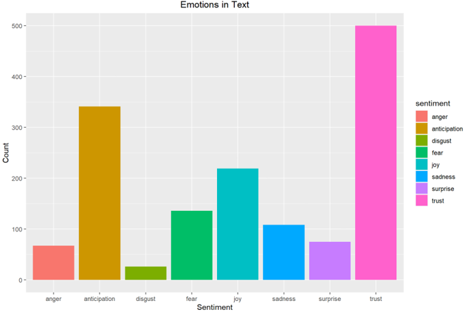

 
<h1>Word Cloud and Sentiment Analysis of Singapore Budget 2021</h1>

In this data analyst project, I leverage the power of R programming to analyze and visualize sentiments expressed in the Singapore Budget 2021. The project aims to provide valuable insights into public perception and sentiment surrounding key budgetary decisions.

__Objective:__
 
The primary objective of this project is to employ R programming for in-depth sentiment analysis and the creation of a visually engaging word cloud based on the Singapore Budget Speech 2023. By doing so, the project seeks to uncover the emotional tone of the public discourse and highlight key themes that resonate with the community.

__Process:__
For data cleaning, the texts are converted to lower case, numbers removed and common words removed, punctuation removed, white space removed and words reduced to their root form (stemming). Additionally, I also removed words such as 'take', 'year', 'also' etc. to optimise the wordcloud visualisation.

---

__Findings:__

From the 10 most frequent words, we can infer the key message from the budget is that there “Will” be “Support” for“Business” and “Worker” because of “Covid”

 

The graph reflect the sentiment score of each progressive sentence from the start of the budget speech (left of the x-axis) to the end of the budget speech (right of the x-axis). From the chart, the valence of the emotion contained in the speech is generally positive throughout.

 

 

Overall, the budget speech contains expressions associate especially with Trust, Anticipation and Joy. 

